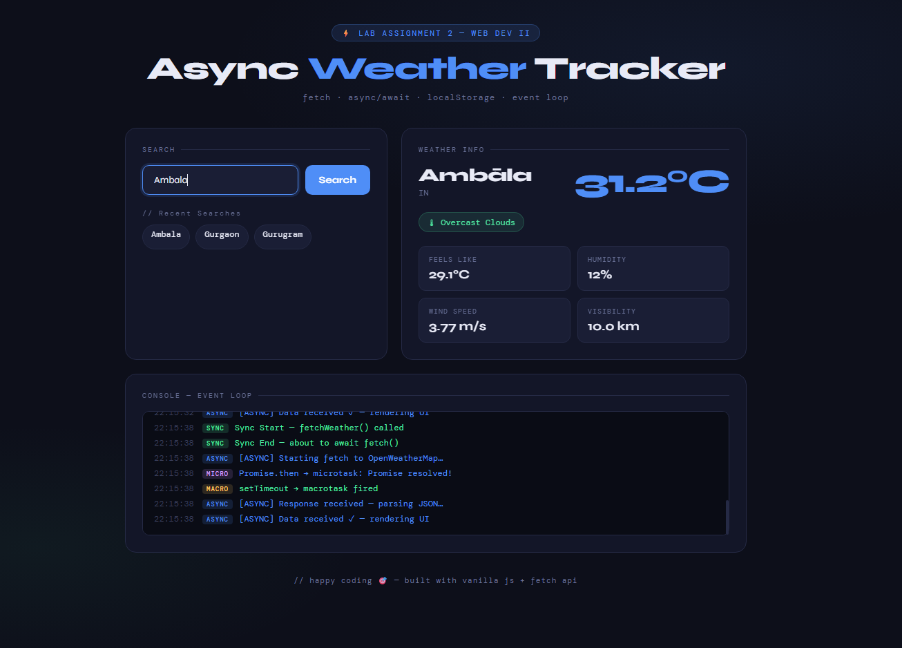

# Async Weather Tracker

> A modern front-end application designed to demonstrate asynchronous JavaScript execution, REST API integration, and event loop mechanics through real-time weather tracking.

## Overview

The Async Weather Tracker is a vanilla JavaScript application that fetches live weather data using the OpenWeatherMap API. Beyond standard data retrieval, it features an integrated on-screen console that visually logs the JavaScript execution sequence. It actively distinguishes between synchronous code, microtasks (Promises), and macrotasks (setTimeout), making it an excellent visualization tool for understanding `async/await` and the browser event loop.

## Key Features

* **Real-Time Data Fetching:** Retrieves current temperature, "feels like" metrics, humidity, visibility, and wind speed using the Fetch API.
* **Event Loop Visualizer:** An interactive console panel that tracks and color-codes function calls in real-time (Sync, Async, Microtask, Macrotask, Error).
* **Persistent Search History:** Utilizes the browser's `localStorage` to save, manage, and display recent city searches for quick access.
* **Responsive Architecture:** A clean, minimal dark-mode interface built with CSS Grid, Flexbox, and modern typography (Syne & DM Mono).
* **Robust Error Handling:** Graceful UI degradation and console logging for network timeouts and invalid queries.

## Tech Stack

* **Markup & Styling:** HTML5, CSS3 (Custom Properties, Grid, Animations)
* **Logic:** Vanilla JavaScript (ES6+)
* **External Services:** OpenWeatherMap API
* **Typography:** Google Fonts (Syne, DM Mono)

## Getting Started




### Prerequisites

A modern web browser and a local development server (like VS Code's Live Server extension) are recommended to avoid strict CORS restrictions when testing local files.

### Installation & Setup

1.  Clone the repository:
    ```bash
    git clone [https://github.com/yourusername/async-weather-tracker.git](https://github.com/yourusername/async-weather-tracker.git)
    ```
2.  Navigate to the project directory:
    ```bash
    cd async-weather-tracker
    ```
3.  Launch the application:
    Serve the `index.html` file using your preferred local web server or open it directly in your browser.

## Project Structure

```text
/
|-- index.html      # Main markup, grid layout, and UI skeleton
|-- styles.css      # Design system, CSS variables, and keyframe animations
|-- script.js       # Core logic, API fetching, DOM manipulation, and state management
|-- README.md       # Project documentation# Assignment-2_WebDev
